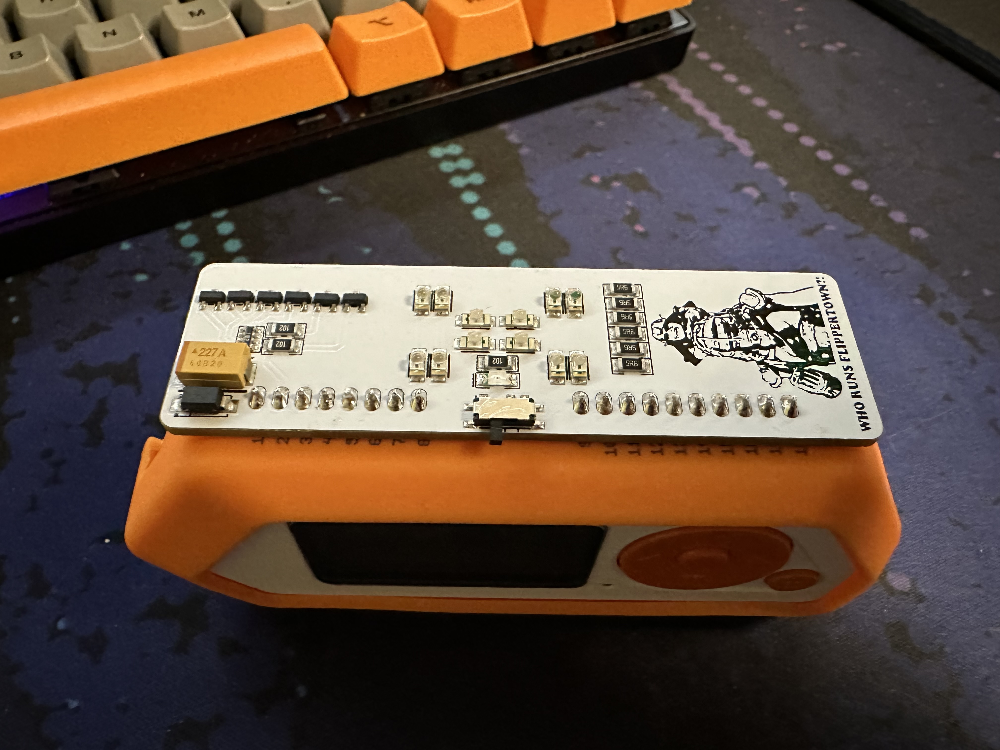

Title: The Pocket Sun
Date: 2023-10-02 20:20 EDT

# The Pocket Sun

Recently picked up a high power IR blaster from my Flipper Zero. Basically its a board that plugs into the GPIO on the Flipper, and can out put IR transmissions, at a way higher power level than the built in IR blaster.  
I've had a higher power blaster for a while. The [Death Star](https://www.tindie.com/products/tehrabbitt/flipper-zero-ir-blaster/). The down side with that one, is that you can't hide it well. The board sticks straight out form the Flipper. And it has a bright ass green power LED.

This new one. The [Masta-Blasta](https://www.tindie.com/products/tehrabbitt/the-masta-blasta-ir-blaster-by-rabbit-labs/), sits flush on the back of the flipper (and has a higher power output). This makes it way easier to hide in a pocket.

This board has way more then enough power to punch right through a pocket. With that, you can just walk around, and turn things on and off with out touching the Flipper. (The Power LED also has a power switch now, for stealth mode.)

Here is a gif recorded on a New 3DSXL  

Just keep in mind, you will light up like a Christmas tree on security cameras.

[Reply to this post via email](mailto:reply.13a8f@nthp.me?subject=Re: The Pocket Sun)